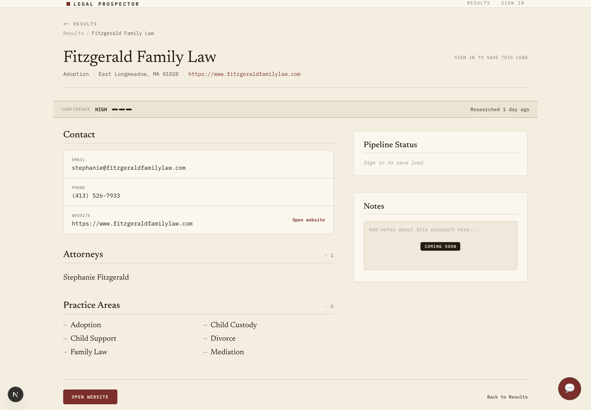
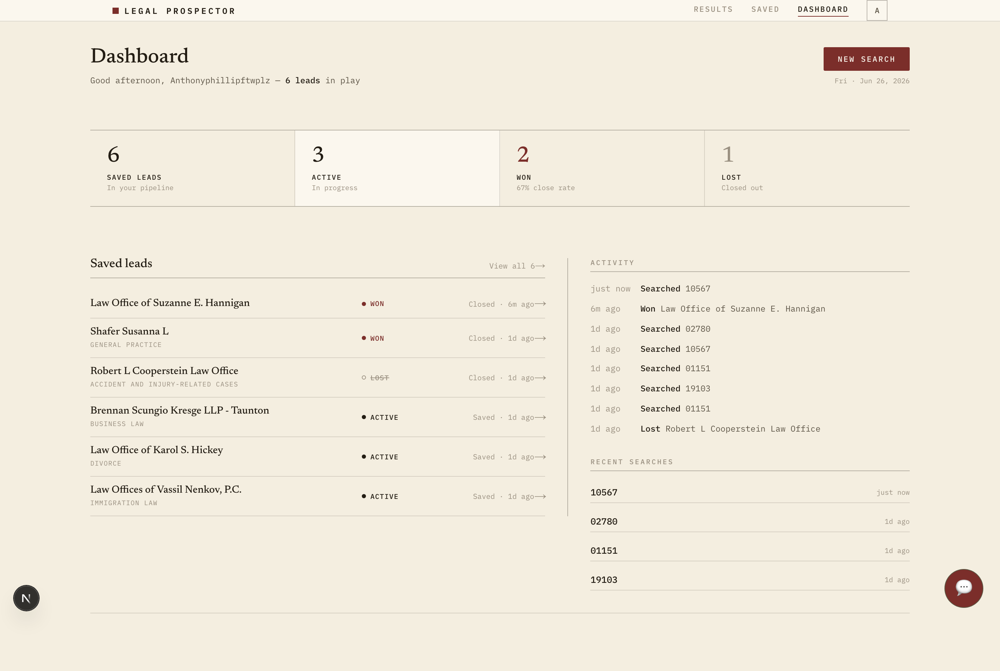
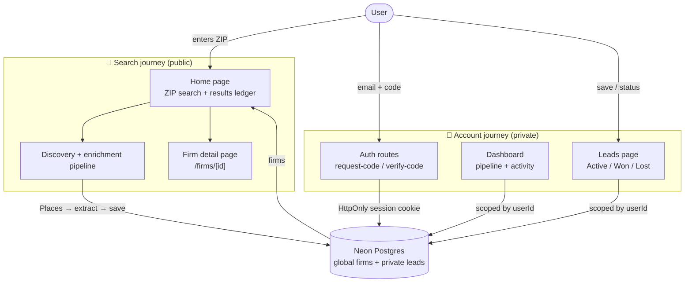
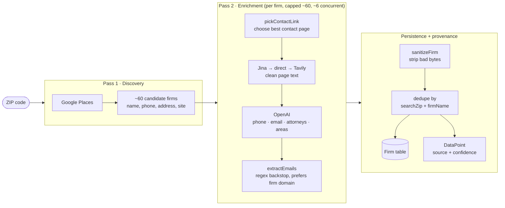
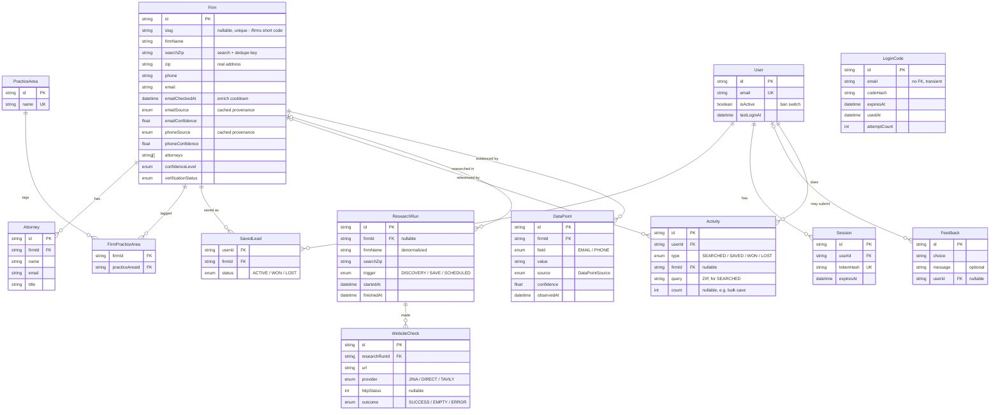

# Legal Prospector


> **Turn a ZIP code into an accurate, workable pipeline of small and boutique law firms, with the contact and firm data that Google misses.**

Legal Prospector is a prospecting tool for sales teams that sell to small and boutique law firms. Finding these firms is slow, manual work: Google Maps gives you a pin and maybe a phone number, but it misses attorneys, practice areas, and reliable contact details, and the data goes stale. Legal Prospector automates that research and turns it into a pipeline you can actually work.

🔗 **Live demo:** [legal-prospect.vercel.app](https://legal-prospect.vercel.app)

---

## How it works

The path from a cold ZIP code to a tracked deal is four steps.

### 1. Search a ZIP

Type one ZIP or several at once (up to five). Legal Prospector discovers every small and boutique firm in that area through Google Places, then visits each firm's website to pull the details Google misses: attorneys, practice areas, and reliable contact info. Results land in a sortable, paginated ledger, exact-ZIP filtered so a tight search doesn't drag in neighboring towns, with the firms most likely to have a usable email up top.


### 2. Open a firm

Click any row for the full profile: the firm's contact details, every attorney, all practice areas, and a confidence read on how trustworthy the contact data is. This is the view a rep works from before reaching out.



### 3. Save and work the pipeline

Saving a firm adds it to your private Leads list, and fires a deeper contact-page fetch to recover an email where the homepage never exposed one. Move each lead through an **Active / Won / Lost** pipeline as you work it, filter by status, and click any lead back through to its full profile.


### 4. Track at a glance

The dashboard rolls it all up: pipeline counts, your recent searches as one-tap chips, and an activity feed of what you've searched, saved, and closed.



The whole thing rests on one rule, which is the entire reason accounts exist: **firm research is global and shared across everyone, but your pipeline is private and scoped to you.**

---

## Tech stack

| Layer | Technology |
| --- | --- |
| Framework | Next.js (App Router) · React · TypeScript |
| Database | Neon Postgres (one shared DB for local + production) |
| ORM | Prisma |
| Firm discovery | Google Places API |
| Page extraction | Jina Reader → direct fetch → Tavily Extract (switchable via `EXTRACT_PROVIDER`) |
| Structured extraction | OpenAI (env-driven: `gpt-5.5` thorough, a smaller model for quick) |
| Auth email | Resend (one-time login codes) |
| Testing | Vitest (353 passing) |
| Hosting | Vercel (Pro) |

---

## Architecture

The app is **two journeys that share one database**: a public *search* journey, and a private *account* journey. Firm research is global and shared across all users; saved leads are private and scoped to one user.



---

## The enrichment pipeline

A ZIP becomes real firm data in **two passes**. The key idea: the LLM does one narrow, supervised job, extracting fields from a real page. It never invents the list of firms.



**The `searchZip` design decision.** Discovery and dedupe key off `searchZip`, a column kept deliberately *separate* from the firm's real physical `zip`. Early on, one `zip` column did both jobs, and Google Places kept overwriting the search key with each firm's actual address, silently corrupting cache reads. Splitting the key from the real address fixed it. The lesson baked into the schema: **never overload one column as both a lookup key and mutable data.**

Persistence is **cache-first**, so each ZIP is only researched once (a `?refresh=true` toggle forces a re-run). **Per-field provenance and confidence back each value**: every observed email and phone is written as a `DataPoint` with a source and confidence, and `Firm` exposes the highest-confidence value, so a later low-confidence value (a wrong-site gmail) can't clobber a good one (a firm-domain address). Every research pass is also logged as a `ResearchRun` with its `WebsiteCheck`s, recording which sites blocked bots or returned nothing.

**Email yield is structurally low** (~23% of firms, vs ~94% with a phone), because law firm homepages rarely expose an address. Saving a lead triggers a deeper contact-page pass that scrapes `mailto:` links and cleaned text with a firm-domain preference, spending the extra effort only on firms someone actually saved; a 30-day cooldown (`Firm.emailCheckedAt`) keeps it from re-hitting no-email sites. Phone, the more useful number for outreach, comes back reliably from Places.

---

## Data model

Thirteen tables across two layers — a research corpus and an auth/workspace layer, joined by a single bridge — plus a research-audit and provenance trio and a per-user activity log.



**Research corpus (global, shared):** `Firm` is the center, with `Attorney` one-to-many off it and `PracticeArea` many-to-many with firms through the `FirmPracticeArea` join table. Practice-area reads come from these normalized tables; the `Firm.practiceAreas` / `Firm.attorneys` `String[]` columns are retained as a transitional fallback.

**Auth + workspace (private):** `User` owns `Session` rows; `LoginCode` is standalone with no foreign key because it's a transient credential keyed by email. `SavedLead` carries a per-lead `status` (the Active / Won / Lost pipeline), and `Activity` is a per-user event log (searches and lead-status changes) that powers the dashboard feed and recent-search chips.

**Research audit + provenance:** `ResearchRun` records one research pass (when, why, for which firm) and owns many `WebsiteCheck` rows, one per fetch attempt, capturing the provider, HTTP status, and outcome — where bot-blocked and dead sites get recorded. `DataPoint` records per-field provenance: each observed email and phone with its source and confidence, which `Firm` projects as its highest-confidence current best.

**The bridge:** `SavedLead` is the only table connecting the research corpus to a specific user, the same join-table pattern as `FirmPracticeArea`. `Feedback` and `Activity` link to `User` (the former nullable, so feedback can be anonymous).

---

## Project structure

```
legal-prospector/
├── prisma/
│   ├── schema.prisma           # 13 models, 10 enums
│   └── migrations/             # additive-only migration history
├── scripts/
│   ├── backfill-practice-areas.ts   # one-time normalized-table backfill
│   ├── dedupe-practice-areas.ts     # one-time case-variant merge
│   ├── readme-shots.ts              # Playwright README screenshots
│   └── make-dumps.sh                # regenerate source dumps
├── src/
│   ├── app/
│   │   ├── page.tsx            # home, ZIP search + results ledger
│   │   ├── firms/[id]/page.tsx # firm detail (resolves by slug or id)
│   │   ├── dashboard/page.tsx  # pipeline + activity        (private)
│   │   ├── leads/page.tsx      # saved leads + status        (private)
│   │   ├── account/page.tsx    # account info               (private)
│   │   ├── login/page.tsx      # email-code sign in
│   │   ├── about/page.tsx · contact/page.tsx · signup/page.tsx
│   │   ├── api/
│   │   │   ├── auth/{request-code,verify-code,sign-out}/route.ts
│   │   │   ├── prospects/search/route.ts   # ZIP search pipeline
│   │   │   ├── leads/route.ts              # save / remove / status
│   │   │   ├── leads/enrich/route.ts       # save-triggered email pass
│   │   │   ├── searches/recent/route.ts    # recent-search chips
│   │   │   └── feedback/route.ts
│   │   ├── layout.tsx          # NavBar + Footer + FeedbackWidget
│   │   └── globals.css
│   ├── components/
│   │   ├── NavBar.tsx · AvatarMenu.tsx · ResultsLedger.tsx
│   │   ├── SavedLeadsLedger.tsx · SavedLeadsClientPage.tsx · LeadStatusFilter.tsx
│   │   ├── FirmDetail.tsx · DashboardSearch.tsx
│   │   └── Footer.tsx · FeedbackWidget.tsx
│   ├── lib/
│   │   ├── prisma.ts · auth/session.ts · confidence.ts · slug.ts
│   │   ├── leads.ts · activity.ts · feedback.ts · practiceAreas.ts
│   │   ├── db/{saveResearchFirms,persistResearchAudit}.ts
│   │   └── research/  # runLeadResearch · extract · enrichDecision · evidence · sanitize · searchProviders/{places,jina,tavily}
│   ├── utils/         # parseZipInput · prospectMatcher · leadStatus · activityFeed · recentSearches
│   └── generated/prisma/       # generated Prisma client
└── tasks/
    └── current-task.md         # the one task currently in flight
```

---

## Routes

| Route | Type | Auth | Purpose |
| --- | --- | --- | --- |
| `/` | Page | Public | ZIP search + results ledger |
| `/firms/[id]` | Page | Public | Firm detail (resolves by slug or id) |
| `/about` · `/contact` | Page | Public | Marketing / info pages |
| `/login` · `/signup` | Page | Public | Email-code sign in |
| `/dashboard` | Page | Private | Pipeline tiles, recent searches, activity feed |
| `/leads` | Page | Private | Saved leads, status filter, click-through to firm detail |
| `/account` | Page | Private | Account info |
| `GET /api/prospects/search` | API | Public | ZIP search, discovery + enrichment, cache-first (`?refresh=true` forces a re-run) |
| `POST /api/auth/request-code` | API | Public | Send a one-time login code |
| `POST /api/auth/verify-code` | API | Public | Verify code, set session cookie |
| `POST /api/auth/sign-out` | API | Public | Clear the session |
| `/api/leads` | API | Private | Save / list / remove saved leads (bulk) |
| `PATCH /api/leads` | API | Private | Update a saved lead's status (Won / Lost / reopen) |
| `POST /api/leads/enrich` | API | Private | Save-triggered deep email pass |
| `GET /api/searches/recent` | API | Private | Recent search ZIP chips |
| `POST /api/feedback` | API | Public | Capture in-app feedback |

> The home route calls `GET /api/prospects/search`, which runs the discovery + enrichment pipeline server-side.

---

## Local setup

**Prerequisites:** Node.js, a Neon Postgres database, and API keys for Google Places, Tavily, OpenAI, and Resend.

```bash
# 1. install
npm install

# 2. configure environment (see table below)
cp .env.example .env        # then fill in real values

# 3. set up the database
npx prisma migrate dev      # applies migrations + generates the client

# 4. run
npm run dev                 # http://localhost:3000
```

> **Migrations are strictly additive.** Local and production share one Neon database, so this project never resets or drops. Every schema change is a new additive migration, and the SQL is reviewed before it's applied.

### Environment variables

| Variable | Purpose |
| --- | --- |
| `DATABASE_URL` | Pooled Neon connection string |
| `DIRECT_URL` | Direct Neon connection (for migrations) |
| `GOOGLE_PLACES_API_KEY` | Firm discovery |
| `TAVILY_API_KEY` | Website finding + last-resort extraction |
| `JINA_API_KEY` | Jina Reader extraction (optional; primary extractor) |
| `OPENAI_API_KEY` | Structured field extraction |
| `SEARCH_PROVIDER` | Discovery provider switch (`places`) |
| `EXTRACT_PROVIDER` | Extraction provider switch (`jina`, `direct`, or `tavily`) |
| `RESEND_API_KEY` | Sending login-code emails |
| `AUTH_EMAIL_FROM` | From address for auth emails |
| `AUTH_SESSION_SECRET` | Pepper for hashing session tokens (identical local + prod) |
| `AUTH_SESSION_COOKIE_NAME` | Session cookie name |
| `APP_BASE_URL` | Base URL (differs per environment) |

---

## Testing

```bash
npx vitest run        # full suite (353 passing)
npx tsc --noEmit      # type check
```

The test suite is the safety net that makes it safe to move fast. Every change, including ones implemented by the coding agent, runs against it. Development is **test-driven**: new behavior starts as a failing test, then the smallest change to make it pass. Route logic, auth flows, lead saving and status, dedupe edge cases, provenance and confidence tiering, activity formatting, and pure helpers like `pickContactLink` and `getPracticeAreaNames` are all covered.

> Repo gotchas: route files and tests use **relative imports** (the `@/` alias isn't resolved by the Vitest runner), any module importing `server-only` is mocked with `vi.mock("server-only", () => ({}))`, and one-off scripts that import Prisma must run as `npx tsx --conditions=react-server scripts/<name>.ts`.

---

## How this was built

This project was built with a deliberate **three-way development loop**: a human reviewer, a planning AI acting as architect, and a separate CLI coding agent doing implementation, with guardrails at every step (plans before code, additive-only migrations, full-file-contents reports, human-run commands). See **[`docs/how-we-build.md`](docs/how-we-build.md)** for the full process.

---

## Roadmap

**Near term**
- **User-private lead overrides**: per-user corrected email, phone, and notes that shadow the global `Firm` values in that one user's view, never touching the shared record.
- **Firm-level confidence badge**: the confidence *sort* already runs (results order by a tier derived from contact provenance); the remaining piece is a single visible high/medium/low badge per firm, then a confidence filter.
- **Attorney-level email and phone enrichment** via bio-page scraping — the real answer to low email yield, since bio pages expose email more often than firm pages.
- **Practice-area filter**: once a stronger canonicalizer collapses the acronym, slash, and compound-phrase long tail.

**The bigger arc, from a search tool to a data product**
- The evidence trail is partly built — audit logging (`ResearchRun` + `WebsiteCheck`) and per-field provenance (`DataPoint`) for email and phone are live. Still ahead: `Prediction` (guessed values kept strictly separate from observed), propensity-to-buy lead scoring, and practice-area gap analysis.
- A background engine (`waitUntil` / Vercel Cron / a queue) for scheduled freshness re-checks and out-of-request enrichment.
- Website-liveness outreach triggers and attorney-movement detection.
- A sibling judicial-analytics product, the same research discipline pointed at judges.

---

<!-- Screenshots live in docs/images/, generated by scripts/readme-shots.ts (search-results, firm-detail, dashboard, saved-leads). Sized with  so they don't dominate the page. Tweak the numbers to taste. -->