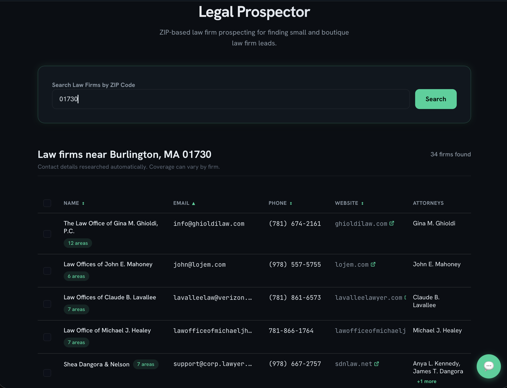
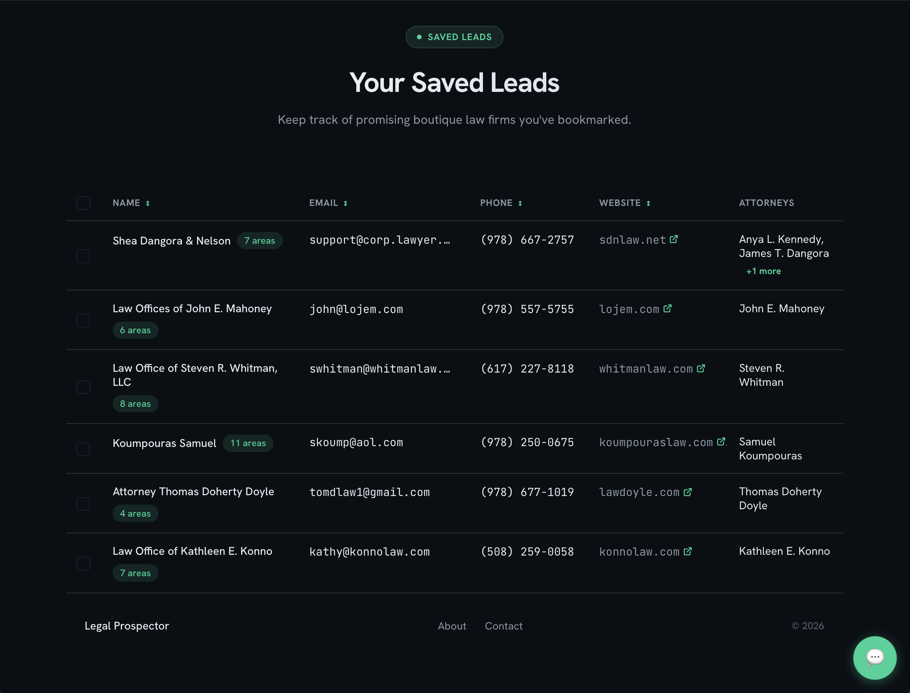
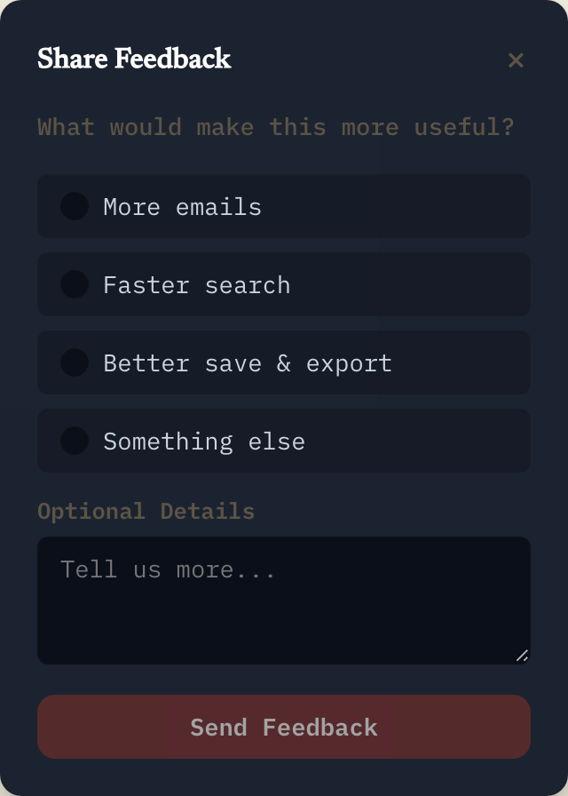
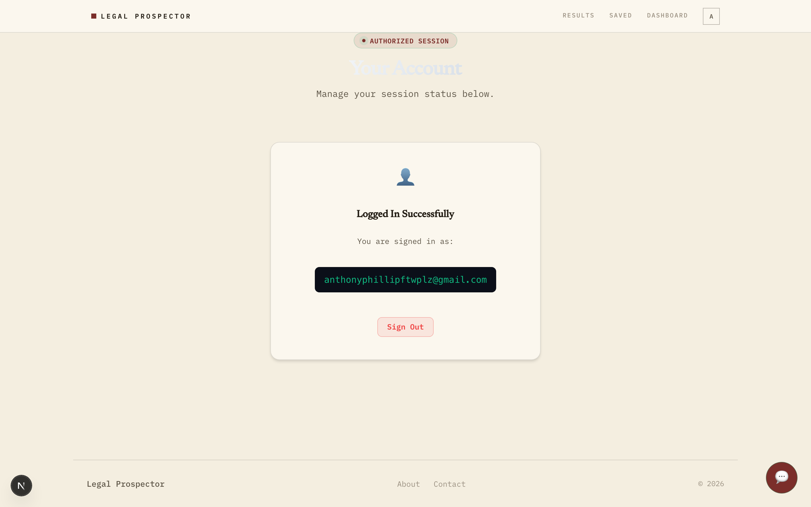
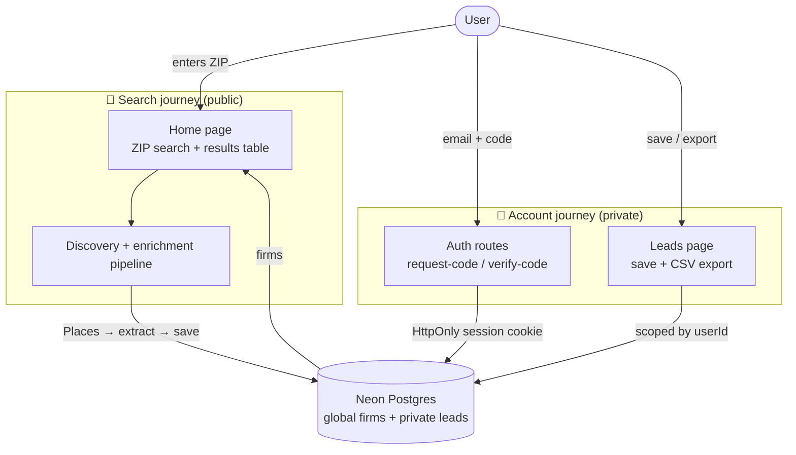
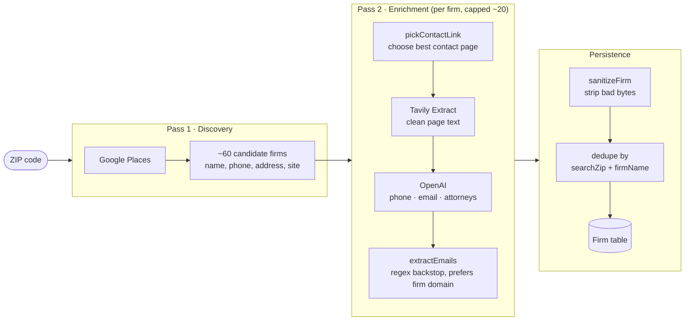
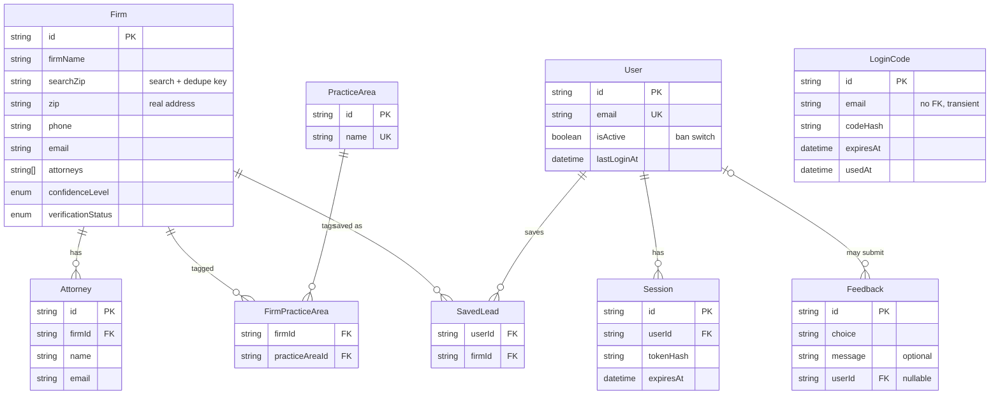

# Legal Prospector


> **Turn a ZIP code into an accurate, exportable list of small and boutique law firms, with the contact and firm data that Google misses.**

Legal Prospector is a prospecting tool for sales teams that sell to small and boutique law firms. Enter a ZIP code and it discovers the firms in that area, visits each firm's website, and pulls structured contact and firm details like phone, attorneys, and practice areas, then lets a signed-in user save and export the best leads.



🔗 **Live demo:** [legal-prospect.vercel.app](https://legal-prospect.vercel.app)

---

## What it does

Finding small law firms is traditionally slow, manual work. Google Maps gives you a pin and maybe a phone number, but it misses attorneys, practice areas, and reliable contact details, and the data goes stale. Legal Prospector automates that research:

- **Search by ZIP**: discovers the firms in an area in one query.
- **Automatic enrichment**: visits each firm's site and pulls phone, attorneys, and practice areas with an LLM, grounded in the firm's real website.
- **Sortable results**: review firms in a clean, paginated table.
- **Save & export**: signed-in users bookmark firms to a private Leads list and export to CSV.
- **Email-code accounts**: passwordless sign-in via a one-time code.

---

## Screenshots

**Saved leads**: bookmark firms to a private, exportable list.



**In-app feedback**: a dismissible widget that writes to the `Feedback` table.



**Account menu**: the signed-in workspace, with Dashboard, Leads, and Account.



---

## Tech stack

| Layer | Technology |
| --- | --- |
| Framework | Next.js (App Router) · React · TypeScript |
| Database | Neon Postgres (one shared DB for local + production) |
| ORM | Prisma |
| Firm discovery | Google Places API |
| Page extraction | Tavily Extract (falls back to direct fetch) |
| Structured extraction | OpenAI <!-- TODO: confirm exact model string in code (e.g. gpt-5.4-mini) --> |
| Auth email | Resend (one-time login codes) |
| Testing | Vitest (223 passing) |
| Hosting | Vercel (Pro) |

---

## Architecture

The app is **two journeys that share one database**: a public *search* journey, and a private *account* journey. Firm research is global and shared across all users; saved leads are private and scoped to one user.



The dividing line is the whole reason auth exists in this app: **global research data can be shared, but user workflow data must be private.**

---

## How it works: the enrichment pipeline

A ZIP becomes real firm data in **two passes**. The key idea: the LLM does one narrow, supervised job, extracting fields from a real page. It never invents the list of firms.



**The `searchZip` design decision.** Discovery and dedupe key off `searchZip`, a column kept deliberately *separate* from the firm's real physical `zip`. Early on, one `zip` column did both jobs, and Google Places kept overwriting the search key with each firm's actual address, silently corrupting cache reads. Splitting the key from the real address fixed it. The lesson baked into the schema: **never overload one column as both a lookup key and mutable data.**

Persistence is **cache-first**, so each ZIP is only researched once. Known limitation: **email yield is low**, because law firm homepages rarely expose an email address. A dedicated contact-page pass is on the roadmap. Phone, the more useful number for outreach, comes back reliably from Places.

---

## Data model

Nine tables in two layers, a research corpus and an auth/workspace layer, joined by a single bridge.



**Research corpus (global, shared):** `Firm` is the center, with `Attorney` one-to-many off it and `PracticeArea` many-to-many with firms through the `FirmPracticeArea` join table.

**Auth layer (private):** `User` owns `Session` rows; `LoginCode` is standalone with no foreign key because it's a transient credential keyed by email.

**The bridge:** `SavedLead` is the only table connecting the two layers, a many-to-many between `User` and `Firm`, the same join-table pattern as `FirmPracticeArea`. `Feedback` is an optional, nullable link to `User`, so feedback can be anonymous or attributed.

---

## Project structure

```
legal-prospector/
├── prisma/
│   ├── schema.prisma           # 9 models, 3 enums
│   └── migrations/             # additive-only migration history
├── src/
│   ├── app/
│   │   ├── page.tsx            # home, ZIP search + results
│   │   ├── about/page.tsx
│   │   ├── contact/page.tsx
│   │   ├── login/page.tsx      # email-code sign in
│   │   ├── leads/page.tsx      # saved leads + CSV export  (private)
│   │   ├── account/page.tsx    # account info             (private) [confirm path]
│   │   ├── api/
│   │   │   ├── auth/
│   │   │   │   ├── request-code/route.ts
│   │   │   │   └── verify-code/route.ts
│   │   │   ├── leads/route.ts          # bulk save / remove
│   │   │   └── feedback/route.ts       # feedback capture
│   │   ├── layout.tsx          # NavBar + Footer + FeedbackWidget
│   │   └── globals.css
│   ├── components/
│   │   ├── NavBar.tsx · AvatarMenu.tsx · ResultsTable.tsx
│   │   ├── Footer.tsx · FeedbackWidget.tsx
│   ├── lib/
│   │   ├── prisma.ts           # Prisma client singleton
│   │   ├── auth/session.ts     # getCurrentUser, session helpers
│   │   ├── leads.ts · feedback.ts
│   │   └── ...                 # discovery / enrichment / pickContactLink [confirm filenames]
│   └── generated/prisma/       # generated Prisma client
└── tasks/
    └── current-task.md         # the one task currently in flight
```

---

## Routes

| Route | Type | Auth | Purpose |
| --- | --- | --- | --- |
| `/` | Page | Public | ZIP search + results table |
| `/about`, `/contact` | Page | Public | Static info |
| `/login` | Page | Public | Email-code sign in |
| `/leads` | Page | Private | Saved leads + CSV export |
| `/account` | Page | Private | Account info |
| `GET /api/prospects/search` | API | Public | ZIP search, discovery + enrichment, cache-first (`?refresh=true` forces a re-run) |
| `POST /api/auth/request-code` | API | Public | Send a one-time login code |
| `POST /api/auth/verify-code` | API | Public | Verify code, set session cookie |
| `/api/leads` | API | Private | Save / list / remove saved leads (bulk) |
| `POST /api/feedback` | API | Public | Capture in-app feedback |

> The home route calls `GET /api/prospects/search`, which runs the discovery + enrichment pipeline server-side.

---

## Local setup

**Prerequisites:** Node.js, a Neon Postgres database, and API keys for Google Places, Tavily, OpenAI, and Resend.

```bash
# 1. install
npm install

# 2. configure environment (see table below)
cp .env.example .env        # then fill in real values

# 3. set up the database
npx prisma migrate dev      # applies migrations + generates the client

# 4. run
npm run dev                 # http://localhost:3000
```

> **Migrations are strictly additive.** Local and production share one Neon database, so this project never resets or drops. Every schema change is a new additive migration, and the SQL is reviewed before it's applied.

### Environment variables

| Variable | Purpose |
| --- | --- |
| `DATABASE_URL` | Pooled Neon connection string |
| `DIRECT_URL` | Direct Neon connection (for migrations) |
| `GOOGLE_PLACES_API_KEY` | Firm discovery |
| `TAVILY_API_KEY` | Page content extraction |
| `OPENAI_API_KEY` | Structured field extraction |
| `SEARCH_PROVIDER` | Discovery provider switch (`places`) |
| `EXTRACT_PROVIDER` | Extraction provider switch (default `tavily`) |
| `RESEND_API_KEY` | Sending login-code emails |
| `AUTH_EMAIL_FROM` | From address for auth emails |
| `AUTH_SESSION_SECRET` | Pepper for hashing session tokens (identical local + prod) |
| `AUTH_SESSION_COOKIE_NAME` | Session cookie name |
| `APP_BASE_URL` | Base URL (differs per environment) |

---

## Testing

```bash
npx vitest run        # full suite (223 passing)
npx tsc --noEmit      # type check
```

The test suite is the safety net that makes it safe to move fast. Every change, including ones implemented by the coding agent, runs against it. Development is **test-driven**: new behavior starts as a failing test, then the smallest change to make it pass. Route logic, auth flows, lead saving, dedupe edge cases, and pure helpers like `pickContactLink` are all covered.

> Vitest gotchas in this repo: route files and tests use **relative imports** (the `@/` alias isn't resolved by the runner), and any module importing `server-only` is mocked at the top of the test with `vi.mock("server-only", () => ({}))`.

---

## How this was built

This project was built with a deliberate **three-way development loop**: a human reviewer, a planning AI acting as architect, and a separate CLI coding agent doing implementation, with guardrails at every step (plans before code, additive-only migrations, full-file-contents reports, human-run commands). See **[`docs/how-we-build.md`](docs/how-we-build.md)** for the full process.

---

## Roadmap

**Near term**
- **Email yield**: a dedicated contact-page fetch and a harder `mailto:` scrape, triggered when a user *saves* a lead, to spend extraction effort where it matters.
- **Tighter ZIP targeting + multi-ZIP search**: from client feedback; an opt-in exact-ZIP filter (leaning on `searchZip`) plus searching several ZIPs at once.
- Persistent saved-leads dashboard and per-user search history.

**The bigger arc, from a search tool to a data product**
- Store *evidence*, not just answers: `ResearchRun`, `WebsiteCheck`, and `DataPoint` provenance tables.
- Continuous background enrichment with scheduled freshness re-checks.
- `Prediction`, propensity-to-buy lead scoring derived from the evidence.

---

<!-- Screenshots live in docs/images/. Portrait shots are sized with , tweak the numbers to taste. -->