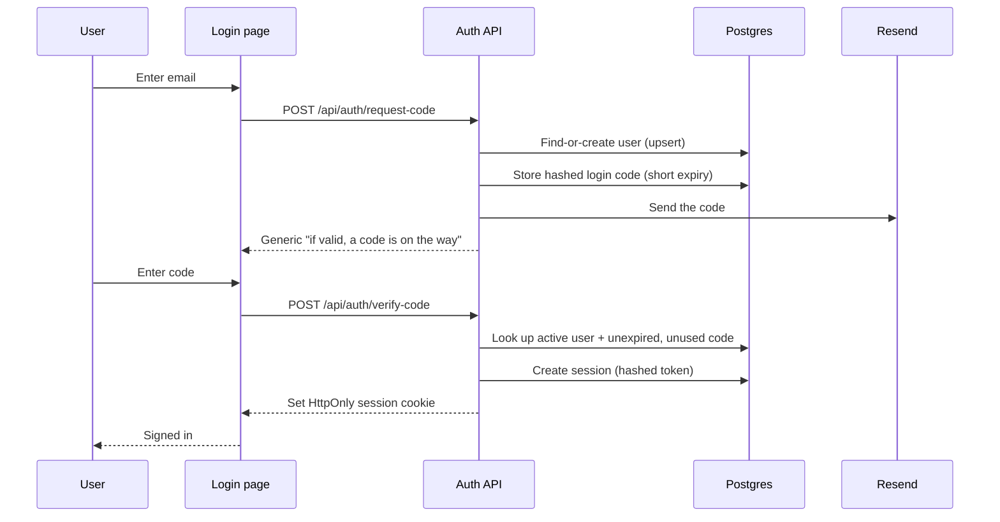

# Architecture

> The engineering deep-dive. For the product overview and the high-level diagrams (architecture, pipeline, ERD), see the [README](../README.md). For how the project is built, see [HOW-WE-BUILD.md](HOW-WE-BUILD.md).

## Two journeys, one database

Legal Prospector is **two journeys that share one Postgres database**:

- A **search journey** (public) — enter a ZIP, get enriched firms, review them in a table.
- An **account journey** (private) — sign in with an email code, save firms to a private Leads list, export.

The hard rule that shapes the whole system: **global research data can be shared, but user workflow data must be private.** Firm research is global — every user who searches `19103` benefits from the same corpus. Saved leads are private — always scoped to one user, never visible to another. That split is the entire reason auth exists here.

---

## Request lifecycles

### 1. A ZIP search

```
ZIP in  →  cache check  →  [miss] discover  →  enrich  →  persist  →  read back  →  render
```

1. **Validate.** The ZIP is normalized to a 5-digit base; anything else is a `400`.
2. **Cache check.** Has this `searchZip` been researched? If so, read the firms straight from the `Firm` table and skip the pipeline. Persistence is cache-first, so each ZIP is only researched once.
3. **Discover (Pass 1).** On a miss, **Google Places** returns ~60 candidate firms for the area (name, phone, address, website).
4. **Enrich (Pass 2, per firm, capped ~20).** For each firm: `pickContactLink` chooses the best contact page → **Tavily Extract** fetches clean page text → an **OpenAI** model extracts phone/email/attorneys → an `extractEmails` regex backstop catches firm-domain emails the model missed.
5. **Persist.** `sanitizeFirm` strips bad bytes → dedupe by `[searchZip, firmName]` (`findFirst`, merge-but-never-downgrade) → save to `Firm`.
6. **Render.** Firms are read back and shown in a sortable, paginated table — ordered by confidence (`HIGH → MEDIUM → LOW → UNKNOWN`), then alphabetically by firm name.

### 2. Signing in (email-code auth)

Passwordless, one-time-code sign-in. Sessions are an **HttpOnly cookie** holding a hashed token — the browser can't read it from JavaScript.



Two security details worth noting: the `request-code` response is **deliberately generic** so it can't be used to discover who has an account, and `isActive` is enforced at `verify-code` — a deactivated user can't complete sign-in, which is the ban switch.

### 3. Saving a lead

A signed-in user selects firms in the results table and saves them. `POST /api/leads` writes `SavedLead` rows — and critically, it scopes everything to the user **from the session**, never from a `userId` sent by the browser. Removing leads (`DELETE`) is the same: a user can only touch their own rows. The global `Firm` records are never modified by either operation.

---

## The enrichment pipeline, in detail

The pipeline's design principle: **the LLM does one narrow, supervised job — extracting fields from a real page — and never invents the list of firms.** Discovery is grounded in Google Places; extraction is grounded in each firm's actual website.

**Pass 1 — Discovery.** Trigger: a cache miss on a ZIP (or a forced refresh). Source: Google Places. Output: candidate firms with identity + basic contact info.

**Pass 2 — Enrichment.** Trigger: each discovered firm, up to a cap of ~20. The flow has fallbacks at each risky step: Tavily Extract falls back to a direct fetch if it returns empty, and the regex `extractEmails` backstops the LLM on email. There's a per-firm timeout so one slow site can't stall the run.

**Persistence.** `sanitizeFirm` exists because scraped and LLM-generated text can contain NUL/control characters that crash Postgres — they're stripped at the save boundary. Dedupe is application-level on `[searchZip, firmName]`, merging into existing rows and never downgrading confidence.

**Known limitation:** email yield is low, because law firm homepages rarely expose an email address. Phone — the more useful number for outreach — comes back reliably from Places. A dedicated contact-page pass is the planned fix (see the README roadmap).

---

## Data model layering

The schema is two layers joined by a single bridge (full ERD in the README):

- **Research corpus (global):** `Firm` at the center, `Attorney` one-to-many off it, `PracticeArea` many-to-many with firms via the `FirmPracticeArea` join table.
- **Auth layer (private):** `User` owns `Session` rows. `LoginCode` is standalone — no foreign key — because a login code is a transient credential keyed by email, not a child of a user.
- **The bridge:** `SavedLead` is the only table connecting the two layers, a many-to-many between `User` and `Firm`. `Feedback` links optionally and nullably to `User`, so it can be anonymous or attributed.

---

## Design decisions and tradeoffs

The reasoning behind the choices — useful context, and the questions most worth being ready for.

**`searchZip` is separate from `zip`.** The search/dedupe key lives in its own column, apart from the firm's real physical ZIP. Originally one `zip` column did both jobs, and Places kept overwriting the search key with each firm's actual address — silently corrupting cache reads and making firm counts drift across discovery, save, and read-back. Splitting them fixed it. *The lesson: never overload one column as both a lookup key and mutable data.*

**Dedupe is application-level, not a DB constraint.** There's no `@@unique` on `Firm`. De-duplication happens in the app via `findFirst` on `[searchZip, firmName]`. A database unique constraint would throw on concurrent saves colliding on the same key; doing it in application logic lets the pipeline merge gracefully instead of erroring.

**One shared database, additive-only migrations.** Local and production point at the same Neon database. The discipline that makes this safe: every schema change is previewed as SQL and only ever *adds* — never a reset, never a destructive push. It's a deliberate solo-build tradeoff, managed with care rather than avoided.

**Cache-first, with an enrichment cap.** Each ZIP is researched once and served from the corpus after that, which keeps third-party API costs bounded and responses fast. The ~20-firm enrichment cap is a cost boundary, not a correctness one.

**The LLM is a component, and its setup was measured.** Extraction is a narrow, replaceable step with a defined contract (page text in → structured fields out). The choice to fetch pages through Tavily Extract rather than a direct fetch was settled by A/B comparison, not a hunch — a measurement, not a guess.

**Global vs. private data is enforced server-side.** Private routes always derive the user from the session and never trust a client-supplied `userId`. This is the backbone of the "shareable research, private workflow" rule.