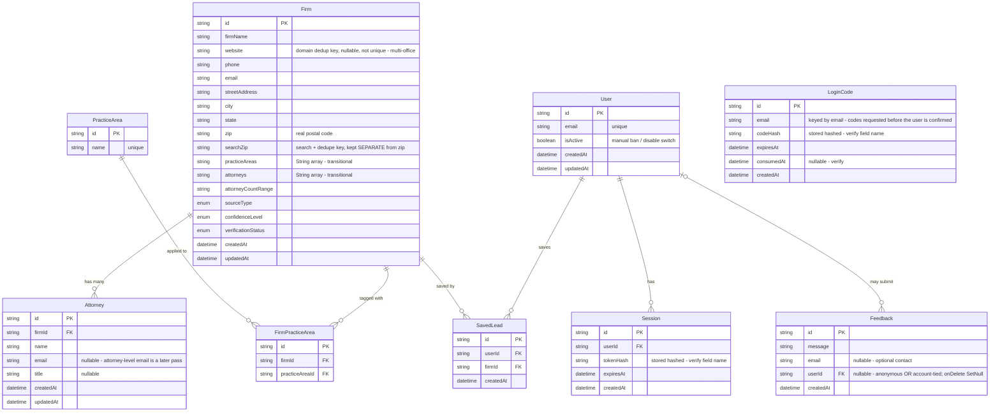

# Legal Prospector — Data Model (ERD)

**9 tables, two layers.** A shared **research corpus** (the firm data — belongs to no single user, continuously enriched) and a private **auth / workspace layer** (user accounts and their saved leads). The two layers are joined by exactly one bridge table — `SavedLead`. The newest table, `Feedback`, attaches to a user *optionally*.

> Reconstructed from the schema docs and the live app. The **structure and relationships are accurate**; confirm exact column names/types against `prisma/schema.prisma` before you present — a few fields are marked *verify*. Paste your `schema.prisma` and I'll make this byte-exact.

## How to walk it (demo order)
1. **Two layers.** A research corpus (firm data, shared) and an auth / workspace layer (user accounts, private), deliberately separate — joined by exactly one bridge: `SavedLead`.
2. **Research corpus.** `Firm` is the center. `Attorney` hangs off it **one-to-many**. `PracticeArea` is **many-to-many** with firms through the join table `FirmPracticeArea` — one firm has many areas, one area spans many firms.
3. **The M:N pattern, used twice.** `FirmPracticeArea` (firms ↔ practice areas) and `SavedLead` (users ↔ saved firms). Same join-table shape both times.
4. **The searchZip story (your gold SQL beat — slow down here).** One `zip` column used to do two jobs: the search / dedupe *key* and the firm's real postal code. Google Places overwrote the real ZIP, silently corrupting cache reads — firms stopped matching. The fix was a schema decision: a separate `searchZip` column for the key, kept apart from the real address. The lesson: never overload one column as both a key and mutable data. Dedupe is on `[searchZip, firmName]`.
5. **Feedback (the new table).** Note the **optional, nullable** user relationship: feedback can be anonymous or tied to an account, and `onDelete: SetNull` means deleting a user keeps the signal — it just detaches it.

## Verify against `schema.prisma` before presenting
- **`searchZip`** — confirm it's present (this is the demo highlight) and that dedupe is `[searchZip, firmName]`.
- **`Session.tokenHash` / `LoginCode.codeHash`** — confirm the exact field names (tokens/codes are stored hashed).
- **`LoginCode`** — confirm whether it's email-keyed only or also carries a `userId` in your schema.
- **`SavedLead`** — may also carry its own columns (e.g. notes / status); confirm.
- **`Feedback`** — your widget has radio options, so there may also be a `category` / `sentiment` column; confirm the non-key fields.
- **`practiceAreas` / `attorneys` (`String[]`)** — transitional dual-write columns; they'll be dropped once reads move to the `Attorney` / `PracticeArea` tables.