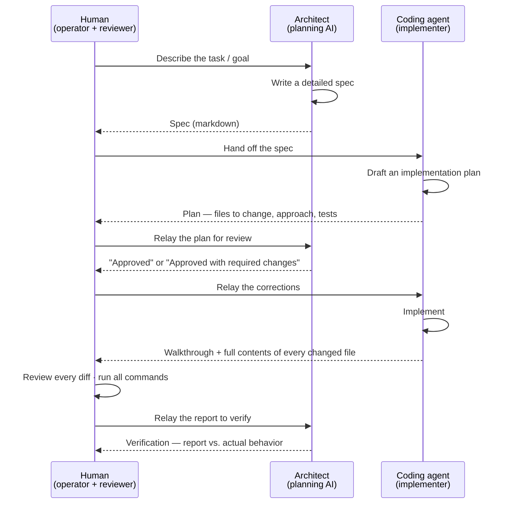

# How We Build

> The development process behind Legal Prospector. For the product overview, see the [README](../README.md); for the system internals, see [ARCHITECTURE.md](ARCHITECTURE.md).

Legal Prospector is built with a deliberate **three-way loop**. Rather than one person prompting an AI to "just build it," the work is split across three roles with a **review gate at every boundary**. The point is separation of duties: the AI that plans isn't the AI that implements, and a human reviews and runs everything in between.

## The three roles

| Role | Who | Responsibility |
| --- | --- | --- |
| **Operator + reviewer** | The human | Owns the work. Reviews every plan and every diff, runs every command, and relays between the two AIs. Never lets an unreviewed change through. |
| **Architect** | A planning AI | Writes detailed task specs, reviews the coding agent's plans, and verifies its reports against the actual result. Writes specs, not code. |
| **Implementer** | A CLI coding agent | Turns an approved spec into code. Returns a plan first, then implements, then reports exactly what it did. Runs no commands itself. |

## The loop

### Step by step

1. **Spec.** The human describes the goal; the architect writes a tight, scoped spec — what to build, the acceptance criteria, the schema/API shape, the exact tests, and the commands the human will run.
2. **Plan.** The human hands the spec to the coding agent, which returns an *implementation plan* — the files it intends to create or modify and its approach — **before writing any code.**
3. **Review the plan.** The human relays that plan back to the architect, who returns either "approved" or "approved with required changes" — concise, relay-ready corrections. Mistakes get caught here, on paper, before they become code.
4. **Implement.** The human relays the corrections; the agent implements, then reports back with a walkthrough **and the full contents of every changed and created file**.
5. **Verify.** The human reviews every diff and runs all the commands (migrations, type-check, tests). The report is relayed to the architect to verify against the actual code and behavior — claims are checked, not trusted.

## The guardrails

These rules are what make handing work to an AI agent *safe*:

- **Plans before code.** The agent never writes until its plan has been reviewed and corrected.
- **The human runs every command.** The AIs never execute anything. No destructive commands ever run.
- **Migrations are additive-only.** Local and production share one database, so schema changes are previewed as SQL and only ever add — never reset, never drop.
- **Reports include full file contents.** Verification is done against the actual output, not a summary of it.
- **Tests are the gate.** Every change runs against the full suite; a change that drops the test count or breaks the type-check doesn't ship.
- **One task at a time.** Each task is a self-contained spec with a downloadable handoff between sessions, so the work stays scoped and reviewable.

## Why it works

Splitting *planning* from *implementation* and inserting a human review gate at each boundary turns "AI-assisted coding" into something closer to running a small, disciplined team. The architect can be opinionated and catch design problems early; the implementer can move fast within a clear spec; and nothing reaches the codebase without a human reading the diff and a test suite backing it up. It's the difference between vibe-coding and **managing** AI.