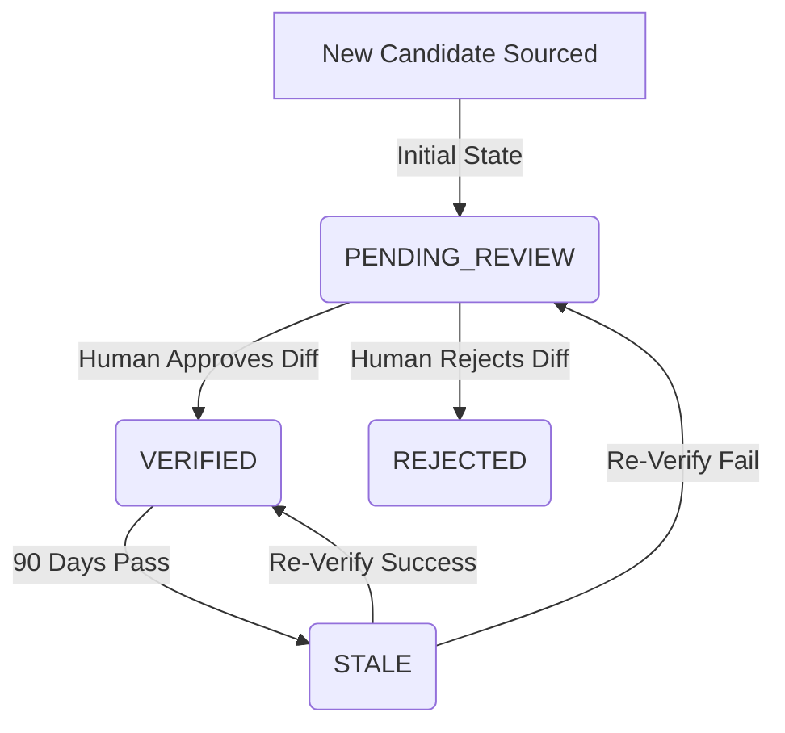

# 13 — First Real-Firm Data Intake Workflow

## 1. Purpose and Scope

This document defines the process and rules for introducing the first batch of verified, real-world law firm records into the Legal Prospector database. 

### Why a Manual Intake First?
Before building automated scrapers, crawler workers, or scaling third-party API integrations, we must define a disciplined, human-scale data entry and validation process. This establishes the baseline for data quality, duplicate prevention, and lifecycle review that future automated systems must emulate.

### Scope Boundaries
* **In-Scope:** Defining target geography, batch size, verification rules, required fields, deduplication keys, manual checklists, and storage mechanisms for the first real records.
* **Out-of-Scope:** Writing scraper code, implementing third-party enrichment APIs, running bulk migrations, or changing the database schema during this phase.

---

## 2. First Target Geography

The first target geography for real-data intake is **ZIP code `19103`** (Center City, Philadelphia, PA).

### Rationale
1. **Consistency:** All mock and API contracts throughout Phase 5 are designed and tested around `19103`.
2. **Side-by-Side Comparison:** Surfacing real firms in the same ZIP code as the demo firms allows direct visual comparison of the UI components under real-world data lengths.
3. **Traceability:** Keeping the initial target small restricts the surface area for manual audits and verification checks.

---

## 3. First-Batch Size

The first real-data batch will contain **5 to 10 verified firms**.

### Rationale
* **Process over Volume:** The primary goal of the first batch is to test the safety and correctness of the ingestion pipeline and UI presentation.
* **Granular Review:** A batch of 5–10 records can be reviewed line-by-line in a git pull request diff by the human project owner.

---

## 4. Firm Qualification Rules

A law firm record qualifies for the first real-data batch only if it meets all of the following:

1. **Boutique Size:** The firm must be a small or boutique office, containing between **1 and 15 attorneys**. Large corporate firms (16+ attorneys) are excluded.
2. **Physical Office Presence:** The firm must maintain a physical office within ZIP code `19103`. Virtual offices or P.O. boxes do not qualify.
3. **Active Web Presence:** The firm must have a live, functioning website under its own domain (not just a secondary directory listing or social media page).
4. **Verifiable Status:** At least one attorney or partner must be listed as active and in good standing on the state bar directory.

---

## 5. Required and Optional Fields

To ensure record completeness, we enforce a strict requirement schema based on the canonical `Firm` database model:

### Required Fields
These fields must be populated for every record in the first batch; they cannot be null or empty:
* `id`: A unique UUID string (generated during entry or upsert).
* `firmName`: Legal or commercial name of the law firm.
* `zip`: Exactly `"19103"`.
* `city`: Exactly `"Philadelphia"`.
* `state`: Exactly `"PA"`.
* `sourceType`: Exactly `"MANUAL"`.
* `sourceUrl`: The exact URL where the data was audited (e.g., the firm's website contact page).
* `confidenceLevel`: Must be set to `HIGH` (since it is manually verified by a human).
* `verificationStatus`: Set to `PENDING_REVIEW` upon entry (transitioning to `VERIFIED` after human seed check).
* `lastCheckedDate`: ISO string timestamp representing the audit date (e.g., `"2026-06-17T17:00:00Z"`).
* `attorneyCountRange`: Standardized enum range matching the roster size: `'1-2' | '3-5' | '6-10' | '11-20'`.

### Optional Fields
These fields may be left blank or set to `null` if the information is not publicly available or applicable:
* `zipExt`: 4-digit ZIP extension (e.g., `"2768"`).
* `streetAddress`: Physical suite/floor details (e.g., `"1717 Arch Street, Suite 4020"`).
* `website`: Canonical website URL (e.g., `"https://langergrogan.com"`).
* `phone`: Normalized contact telephone number.
* `email`: Public contact email (e.g., `"info@langergrogan.com"`).
* `practiceAreas`: Array of specialties (e.g., `["Antitrust", "Consumer Protection"]`).
* `attorneys`: Array of verified lawyer names (e.g., `["John Langer", "Howard Langer"]`).
* `globalNotes`: High-level summary or description of the firm.

---

## 6. Source Priority and Source-Quality Rules

When verifying data points, the researcher must consult sources in this priority order:

1. **Law Firm Official Website (Priority 1):** The primary source of truth for practice areas, attorney lists, phone numbers, and official emails.
2. **State Bar / Disciplinary Board Registries (Priority 2):** The primary source of truth for licensing status and formal attorney names.
3. **Google Business Profile (Priority 3):** Used as secondary corroboration for physical suite locations and active business hours.

### Conflict Resolution Rule
If there is a conflict between sources:
* Official Website details **always supersede** Google Business Profiles or secondary directories (Avvo, YellowPages).
* If phone numbers or suite addresses remain inconsistent, the record must not be assigned a `HIGH` confidence level until a direct contact verification is made.

---

## 7. Confidence and Verification Rules

We apply the system enums to track data confidence and lifecycle status:

### Confidence Level
* **`HIGH`**: Assigned to all records in this manual batch. This represents human verification across both Priority 1 (website) and Priority 2 (bar status) sources.
* **`MEDIUM`**: Sourced from structured APIs with matching domains, but lacks individual page verification.
* **`LOW`**: Sourced solely from search engine directories or stale scrapes.
* **`UNKNOWN`**: Default value for unassessed imports.

### Verification Status Lifecycle

* **`PENDING_REVIEW`**: Initial state of the manually prepared records in the seed template.
* **`VERIFIED`**: Updated by the human project owner once the seed script has run and the output has been visually checked in the browser interface.

---

## 8. Duplicate Handling Rules

Before any record is appended to the first batch, the researcher must verify it is not a duplicate:

1. **Website Domain Normalization:** Strip protocols and subdomains to produce a canonical key (e.g., `https://www.langergrogan.com/index.html` → `langergrogan.com`).
2. **Collision Check:** Search the existing `SEED_PROSPECTS` and database records for the canonical domain.
3. **Fallback Matching:** If no website is available, check for matches on `firmName` + `phone` + `streetAddress`. Strip suffixes like `"LLC"`, `"LLP"`, or `"P.C."` and punctuation before comparison.
4. **Collision Action:**
   * If a record with the same canonical domain already exists, the researcher **must not** create a duplicate.
   * If the existing record is a mock/demo placeholder (e.g. `sourceType: MANUAL_SEED`), the researcher may replace the mock record with the fully audited real record, using the same `id` to maintain integrity.

---

## 9. Manual Review Checklist

The researcher must complete this checklist for every candidate firm before adding it to the ingestion queue:

* [ ] **Uniqueness:** Check that the canonical website domain is not already in the dataset.
* [ ] **Geography:** Verify the physical address lists a suite/office in `19103`.
* [ ] **Phone & Website:** Test that the website loads and the phone number matches the header/footer contacts.
* [ ] **Size Count:** Count the number of individual attorneys on the team page; confirm it falls within the `1-15` range and select the matching range enum (`1-2`, `3-5`, `6-10`, `11-20`).
* [ ] **Active License:** Query the PA State Bar directory to confirm at least one named partner is active and registered.
* [ ] **Formatting:** Strip extra whitespace, normalize phone formatting (e.g. `215-320-5660`), and ensure the record conforms to the `Prospect` TypeScript interface.

---

## 10. Recommended Storage and Import Method

We recommend **Option A: Version-Controlled TypeScript File** (`src/data/real-firms.ts`) for storing the first batch of real records.

### Implementation Workflow
1. Create [real-firms.ts](file:///Users/phillipanthony/Desktop/Phase02/legal-prospecting-planning-docs-starter/src/data/real-firms.ts) containing an array of 5–10 real audited `Prospect` records.
2. Update the main database seed script ([seed.ts](file:///Users/phillipanthony/Desktop/Phase02/legal-prospecting-planning-docs-starter/prisma/seed.ts)) to:
   * Import the new `REAL_FIRMS` array.
   * Upsert the real records into the `Firm` table using their unique UUID `id` keys.
3. Keep the existing fictional `SEED_PROSPECTS` untouched for fallback demo reference (or clear them by setting `sourceType` filters, depending on human preference).

### Advantages
* **Git Auditability:** All real firm details are stored in plain text, making them fully traceable via standard git history.
* **Idempotency:** Upserts prevent duplicate entries even if the seed script is run multiple times.
* **No Dependencies:** Avoids importing complex CSV or JSON parsing packages.

---

## 11. Risks and Guardrails

* **Mixing Real and Demo Data:** In the UI, searching `19103` will return both demo data and real data. 
  * *Guardrail:* The UI cards must clearly differentiate records by rendering their `sourceType` (e.g., a green "Real Verified" badge for `MANUAL` records and a gray "Demo" badge for `MANUAL_SEED` records).
* **Data Drift:** If the database is wiped or reset on the production hosting provider (Neon), manual entries entered directly would be lost.
  * *Guardrail:* By storing the first batch in the version-controlled `real-firms.ts` file, the human can safely restore the dataset at any time by running `npm run db:seed`.

---

## 12. Recommended Next Phase

### Phase 6.2 — Prepare First Reviewed Real-Firm Intake Template
In the next phase, we will:
1. Create the template file `src/data/real-firms.ts`.
2. Populating it with 5–10 real verified law firms following the checklist defined in Section 9.
3. Update `prisma/seed.ts` to load this batch into the Neon Postgres database.
4. Verify the search page displays the new real records alongside appropriate badges.
