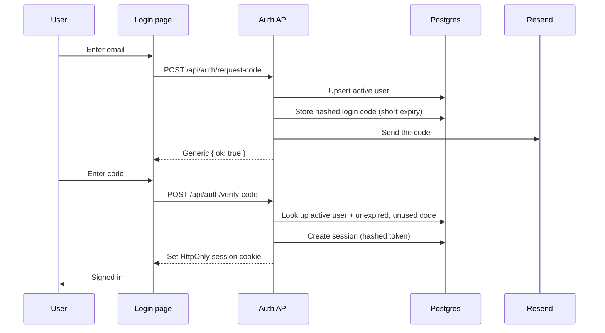

# Architecture

> The engineering deep-dive, verified against source. For the product overview and the high-level diagrams, see the [README](../README.md). For how the project is built, see [how-we-build.md](how-we-build.md); for the HTTP surface, [api-contracts.md](api-contracts.md); for the pipeline pass-by-pass, [data-pipeline.md](data-pipeline.md).

## Two journeys, one database

Legal Prospector is **two journeys that share one Postgres database**:

- A **search journey** (public): enter a ZIP, get enriched firms, review them in a table.
- An **account journey** (private): sign in with an email code, save firms to a private Leads list, export.

The hard rule that shapes the whole system: **global research data can be shared, but user workflow data must be private.** Firm research is global, so every user who searches `19103` benefits from the same corpus. Saved leads are private, always scoped to one user from their session, never visible to another. That split is the entire reason auth exists here.

---

## Request lifecycles

### 1. A ZIP search

```
ZIP in  →  cache check  →  [miss] discover  →  enrich  →  persist  →  read back  →  render
```

1. **Validate.** `normalizeZipCode` accepts a 5-digit code or ZIP+4 and returns the 5-digit base; anything else is a `400`.
2. **Cache check.** Read `Firm` rows for this `searchZip`. If any exist and `refresh` isn't set, return them and skip the pipeline. Persistence is cache-first, so each ZIP is only researched once (until a forced refresh).
3. **Discover (Pass 1).** On a miss, the route runs `runLeadResearch(zip, "thorough")`. With the current `SEARCH_PROVIDER="places"` config, **Google Places** Text Search returns ~60 candidate firms for the area (name, phone, address, website), deduped by normalized name.
4. **Enrich (Pass 2).** For each firm, capped at **60** (`ENRICHMENT_CAP`) and run **~6 concurrently** (`ENRICHMENT_CONCURRENCY`), each with a per-firm timeout: `pickContactLink` picks the best page to read, `extractPageContent` (Tavily Extract, direct-fetch fallback) pulls clean text, an **OpenAI** model extracts phone/email/attorneys/practice-areas, and an `extractEmails` regex backstops the model on email.
5. **Persist.** `saveResearchFirms` runs `sanitizeFirm` to strip NUL/control bytes, then dedupes on `[searchZip, firmName]` via `findFirst`: on a match it updates only the fields whose incoming value is *useful* (a real value is never overwritten with a placeholder) and unions practice areas; otherwise it creates the row. Each firm is saved independently with `Promise.allSettled`, so one bad record can't roll back the batch. Attorneys and practice areas are **dual-written** to the `Attorney` and `FirmPracticeArea` tables alongside the transitional `String[]` columns on `Firm`.
6. **Render.** Firms are read back ordered by `firmName`, then re-sorted in the route by confidence (`HIGH → MEDIUM → LOW → everything else`) and shown in a sortable, paginated table.

### 2. Signing in (email-code auth)

Passwordless, one-time-code sign-in. Sessions are an **HttpOnly cookie** holding a random token; only the cookie holds the raw token, and only its SHA-256 hash is stored in the database.



The specifics: signup is **open / self-serve**, since `request-code` upserts a user with `isActive: true`. Codes are 6 digits, hashed with a peppered SHA-256 (`AUTH_SESSION_SECRET`), expire in 10 minutes, and are rate-limited to 5 per email per hour plus a 60-second resend cooldown. The `request-code` response is **deliberately generic** so it can't reveal who has an account. At `verify-code`, the code is checked (max 5 attempts, unused, unexpired, matching hash), then an **active** user is required, so `isActive: false` is the ban switch, enforced at sign-in. Sessions last 30 days.

### 3. Saving a lead

A signed-in user selects firms in the results table and saves them. `POST /api/leads` writes `SavedLead` rows, scoping everything to the user **from the session**, never from a `userId` sent by the browser. Saving is idempotent (an `upsert` on `[userId, firmId]`); removing (`DELETE /api/leads`, with the firm id(s) in the body) is idempotent too (`deleteMany`). The global `Firm` records are never modified by either operation.

---

## The enrichment pipeline, in detail

The pipeline's design principle: **the LLM does one narrow, supervised job, extracting fields from a real page.** With the Places provider (the current config), the firm *list* comes from Google Places, not the model. Worth being precise for the demo: the codebase still carries `tavily` and `ddg` discovery providers plus an LLM-only fallback that *do* let the model generate firm candidates from its own knowledge when web search is unavailable, and that legacy path is exactly what switching to Places replaced.

**Pass 1 — Discovery.** Trigger: a cache miss on a ZIP (or a forced refresh). Source under the current config: Google Places Text Search. Output: candidate firms with identity plus basic contact info.

**Pass 2 — Enrichment.** Each discovered firm, up to a cap of **60**, run ~6 at a time. The flow has fallbacks at each risky step: Tavily Extract falls back to a direct fetch if it returns empty, and the `extractEmails` regex backstops the LLM on email. A per-firm timeout means one slow site can't stall the run.

**Persistence.** `sanitizeFirm` exists because scraped and LLM-generated text can contain NUL/control characters that crash Postgres; they're stripped at the save boundary. Dedupe is application-level on `[searchZip, firmName]` via `findFirst`, updating only *useful* incoming fields into the existing row and never clobbering a real value with a placeholder. `Promise.allSettled` isolates per-firm failures so a single bad record doesn't sink the batch.

**Known limitation:** email yield is low, because law firm homepages rarely expose an email address. Phone, the more useful number for outreach, comes back reliably from Places. A dedicated save-triggered contact-page pass is the planned fix (see [roadmap.md](roadmap.md)).

---

## Data model layering

The schema is two layers joined by a single bridge (full ERD in [database.md](database.md)):

- **Research corpus (global):** `Firm` at the center, `Attorney` one-to-many off it, `PracticeArea` many-to-many with firms via the `FirmPracticeArea` join table.
- **Auth layer (private):** `User` owns `Session` rows. `LoginCode` is standalone, with no foreign key, because a login code is a transient credential keyed by email, not a child of a user.
- **The bridge:** `SavedLead` is the only table connecting the two layers, a many-to-many between `User` and `Firm`. `Feedback` links optionally and nullably to `User`, so it can be anonymous or attributed.

---

## Design decisions and tradeoffs

**`searchZip` is separate from `zip`.** The search/dedupe key lives in its own column, apart from the firm's real physical ZIP. Originally one `zip` column did both jobs, and Places kept overwriting the search key with each firm's actual address, silently corrupting cache reads and making firm counts drift across discovery, save, and read-back. Splitting them fixed it. The lesson: never overload one column as both a lookup key and mutable data.

**Dedupe is application-level, not a DB constraint.** There's no `@@unique` on `Firm`. De-duplication happens in `saveResearchFirms` via `findFirst` on `[searchZip, firmName]`, merging useful incoming fields into any existing row. A database unique constraint would throw on concurrent saves colliding on the same key; application logic merges gracefully instead, and `Promise.allSettled` keeps one failure from rolling back the whole batch.

**One shared database, additive-only migrations.** Local and production point at the same Neon database. The discipline that makes this safe: every schema change is previewed as SQL and only ever adds, never a reset or a destructive push. A deliberate solo-build tradeoff, managed with care rather than avoided.

**Cache-first, with an enrichment cap.** Each ZIP is researched once and served from the corpus after that, which keeps third-party API costs bounded and responses fast. The 60-firm enrichment cap is a cost boundary, not a correctness one.

**The LLM is a component, and its setup was measured.** Extraction is a narrow, replaceable step with a defined contract (page text in, structured fields out). The choice to fetch pages through Tavily Extract rather than a direct fetch was settled by A/B comparison, not a hunch.

**Global vs. private data is enforced server-side.** Private routes always derive the user from the session and never trust a client-supplied `userId`. This is the backbone of the "shareable research, private workflow" rule.