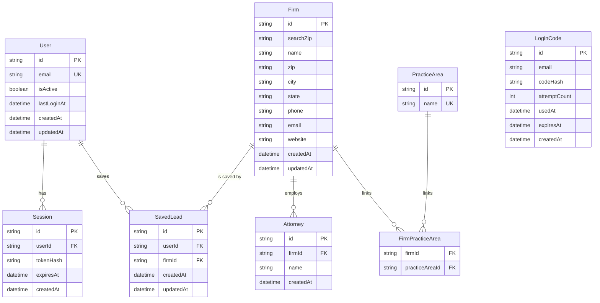

# Legal Prospector — Data Model (ERD)

**8 tables, two layers.** A shared **research corpus** that everyone's searches build up, and a private **auth layer** scoped to each person. One table — `SavedLead` — bridges the two.

> Render this diagram in VS Code (Mermaid extension) or on GitHub.

---

## The two layers

**Research corpus (shared / global).** This is the firm data the product discovers and enriches. It belongs to no one user — every search adds to it.

**Auth layer (private / per-user).** Identity and sessions. This is yours alone.

**The bridge.** `SavedLead` is the only table that connects the two — it ties one `User` to one `Firm`. It's what makes an account mean something: a private list of firms drawn from the shared corpus.

---

## Table-by-table

### Research corpus

- **`Firm`** — the core record. One row per discovered firm. Note the deliberate split between **`searchZip`** (the ZIP that was *searched* — the cache/dedupe key) and the firm's *real* **`zip` / `city` / `state`** (its actual address). Keeping those separate is what fixed the early bug where Google Places overwrote the search key. Also holds the contact fields (`phone`, `email`, `website`) and confidence/verification metadata.
- **`Attorney`** — people at a firm. **One-to-many**: a firm has many attorneys (`firmId` foreign key), with a unique `[firmId, name]` so the same attorney isn't recorded twice at one firm.
- **`PracticeArea`** — a normalized list of practice areas (e.g. "Personal Injury"), each `name` unique.
- **`FirmPracticeArea`** — the **join table** linking firms and practice areas **many-to-many** (a firm has many areas; an area applies to many firms). Composite primary key `[firmId, practiceAreaId]` — one row per firm↔area pairing.

### Auth layer

- **`User`** — one row per account. `email` is unique; **`isActive`** is the enable/disable (ban) switch enforced at sign-in; `lastLoginAt` tracks the last login.
- **`Session`** — active logins. **One-to-many** from `User` (`userId` foreign key, cascade-deletes with the user). Stores a **hashed** token, not the raw one, plus `expiresAt`.
- **`LoginCode`** — the one-time email codes. **Standalone** — keyed by `email` with **no foreign key**, because it's a pre-auth, throwaway credential (the user may not exist yet, and once verified the code is spent). It's a transient credential, not a durable relationship like a session. Codes are **hashed**; `attemptCount` and `usedAt` guard against reuse/brute force.

### The bridge

- **`SavedLead`** — links **`User` ↔ `Firm` many-to-many**. Each row is one save: "this user saved this firm." It stores only the two pointers (`userId`, `firmId`) — never a copy of the firm's data, which lives once in `Firm`. A unique `[userId, firmId]` means you can't save the same firm twice (so saving is idempotent), and both foreign keys cascade-delete so there are never orphan links.

---

## The patterns worth naming

- **One-to-many** (`||--o{`): one parent, many children. `Firm → Attorney`, `User → Session`. The "many" side carries the foreign key.
- **Many-to-many via a join table**: when many of one relate to many of another, a third table in the middle holds one row per pairing. There are **two** of these here — `FirmPracticeArea` (Firm ↔ PracticeArea) and `SavedLead` (User ↔ Firm). They're the same idea aimed at different pairs; explain one and you've explained both.
- **The standalone exception**: `LoginCode` has no relationships at all — a reminder that not everything needs a foreign key. A throwaway, pre-auth credential is keyed by email and stands on its own.