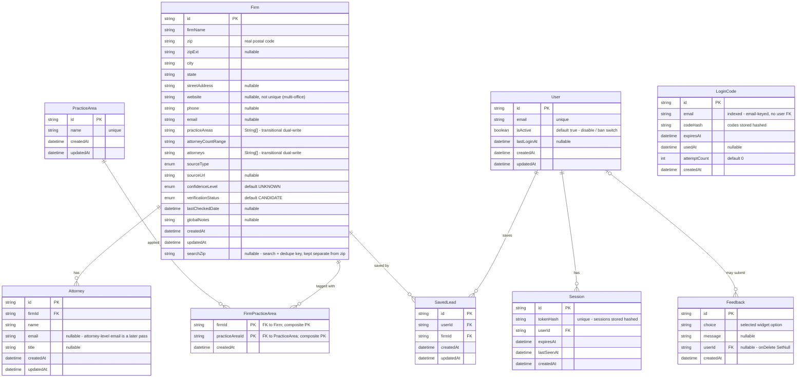

# Legal Prospector — Data Model

Nine tables in two layers. A shared **research corpus** holds firm data that belongs to no single user and is continuously enriched. A private **auth / workspace layer** holds user accounts and their saved leads. The layers are joined by one bridge table, `SavedLead`. `Feedback` attaches to a user optionally.

Verified against `prisma/schema.prisma` and `src/lib/db/saveResearchFirms.ts`.

## Enums

- `ConfidenceLevel`: `HIGH`, `MEDIUM`, `LOW`, `UNKNOWN`
- `VerificationStatus`: `CANDIDATE`, `PENDING_REVIEW`, `VERIFIED`, `REJECTED`, `STALE`
- `SourceType`: `BAR_DIRECTORY`, `GOOGLE_MAPS`, `WEB_SCRAPE`, `MANUAL`, `MANUAL_SEED`

## Layers

**Research corpus** — `Firm` is the center. `Attorney` is one-to-many off `Firm`. `PracticeArea` is many-to-many with `Firm` through the join table `FirmPracticeArea`: one firm has many areas, one area spans many firms.

**Auth / workspace** — `User` owns `Session` records (one-to-many) and may submit `Feedback`. `LoginCode` holds email-verification codes. `SavedLead` is the only table that crosses into the research corpus, linking a `User` to a `Firm`.

## The two many-to-many relationships

Both are implemented as join tables, where each row is one pairing and holds a foreign key to each parent.

- `FirmPracticeArea` (firms ↔ practice areas) uses a composite primary key `@@id([firmId, practiceAreaId])` plus a `createdAt`. No surrogate `id`.
- `SavedLead` (users ↔ firms) uses a surrogate `id` and enforces one save per pair with `@@unique([userId, firmId])`.

Neither junction carries relationship-specific data beyond timestamps.

## searchZip and dedupe

`zip` is the firm's real postal code and can be overwritten by authoritative Places data (location overrides are gated to `GOOGLE_MAPS` sources in the US). `searchZip` is the immutable key the search reads and dedupes on, kept separate so an address update can't corrupt cache lookups. An earlier single `zip` column served both roles, and Places overwriting it broke cache matching.

There is no `@@unique` on `Firm`; dedupe is application-level. `saveResearchFirms` matches an existing firm with `findFirst({ where: { searchZip, firmName } })`. On a match it updates only fields whose incoming values are useful, so placeholders never overwrite real data, and merges practice areas rather than replacing them. Each firm's write is isolated with `Promise.allSettled`, so one failed record does not abort the batch. `Firm` carries three indexes: `@@index([zip])`, `@@index([city, state])`, `@@index([searchZip])`.

## Transitional columns

`Firm.attorneys` and `Firm.practiceAreas` (`String[]`) are written alongside the normalized `Attorney` and `FirmPracticeArea` tables (dual-write). This is an expand/contract migration: the arrays are still the read path, and they will be dropped once reads move to the relational tables. Attorney rows are upserted on `@@unique([firmId, name])`; practice-area links are created with `skipDuplicates`.

## Auth field notes

- `Session.tokenHash` and `LoginCode.codeHash` store hashed values, never the raw token or code. `Session.tokenHash` is `@unique`.
- `LoginCode` is keyed by `email` (indexed) with no foreign key to `User`, because codes are requested before a user is confirmed. It tracks `expiresAt`, `usedAt`, and `attemptCount`.
- `Feedback.userId` is nullable with `onDelete: SetNull`, so deleting a user detaches their feedback rather than removing it. `choice` holds the selected widget option; there is no email field.

###

Practice-area reads come from the normalized PracticeArea and FirmPracticeArea
tables via src/lib/practiceAreas.ts (practiceAreaInclude + getPracticeAreaNames),
sorted and de-duplicated. Firm.practiceAreas String[] is retained as the backfill
source and a fallback, not read in the app. Attorneys still read Firm.attorneys
String[]. Reverting is switching the two read sites back to the array.