# Legal Prospector — Data Model

Thirteen models in two layers. A shared **research corpus** holds firm data that belongs to no single user and is continuously enriched, now with a per-field evidence trail underneath it. A private **auth / workspace layer** holds user accounts, their saved leads, and their activity. The layers are joined by one bridge table, `SavedLead`. `Feedback` and `Activity` attach to a user (the former optionally).

Verified against `prisma/schema.prisma`.

```mermaid
erDiagram
    Firm ||--o{ Attorney : "has"
    Firm ||--o{ FirmPracticeArea : "tagged with"
    PracticeArea ||--o{ FirmPracticeArea : "applied to"
    Firm ||--o{ DataPoint : "evidenced by"
    Firm |o--o{ ResearchRun : "researched in"
    ResearchRun ||--o{ WebsiteCheck : "made"
    User ||--o{ Session : "has"
    User ||--o{ SavedLead : "saves"
    User ||--o{ Activity : "does"
    Firm ||--o{ SavedLead : "saved by"
    Firm |o--o{ Activity : "referenced by"
    User |o--o{ Feedback : "may submit"

    Firm {
        string id PK
        string slug "nullable, unique - short code for /firms URLs"
        string firmName
        string zip "real postal code"
        string zipExt "nullable"
        string city
        string state
        string streetAddress "nullable"
        string website "nullable, not unique (multi-office)"
        string phone "nullable"
        string email "nullable"
        datetime emailCheckedAt "nullable - enrich cooldown hinge"
        enum emailSource "nullable - cached DataPointSource"
        float emailConfidence "nullable - cached"
        enum phoneSource "nullable - cached DataPointSource"
        float phoneConfidence "nullable - cached"
        string practiceAreas "String[] - transitional, backfill source/fallback"
        string attorneyCountRange
        string attorneys "String[] - transitional, still the read path"
        enum sourceType
        string sourceUrl "nullable"
        enum confidenceLevel "default UNKNOWN"
        enum verificationStatus "default CANDIDATE"
        datetime lastCheckedDate "nullable"
        string globalNotes "nullable"
        datetime createdAt
        datetime updatedAt
        string searchZip "nullable - search + dedupe key, kept separate from zip"
    }

    Attorney {
        string id PK
        string firmId FK
        string name
        string email "nullable - attorney-level email is a later pass"
        string title "nullable"
        datetime createdAt
        datetime updatedAt
    }

    PracticeArea {
        string id PK
        string name "unique"
        datetime createdAt
        datetime updatedAt
    }

    FirmPracticeArea {
        string firmId PK "FK to Firm; composite PK"
        string practiceAreaId PK "FK to PracticeArea; composite PK"
        datetime createdAt
    }

    DataPoint {
        string id PK
        string firmId FK
        enum field "EMAIL / PHONE"
        string value
        enum source "DataPointSource"
        float confidence
        datetime observedAt
        datetime createdAt
    }

    ResearchRun {
        string id PK
        string firmId FK "nullable - SetNull"
        string firmName "denormalized, kept even if firmId can't resolve"
        string searchZip "nullable"
        enum trigger "DISCOVERY / SAVE / SCHEDULED"
        datetime startedAt
        datetime finishedAt "nullable"
        datetime createdAt
    }

    WebsiteCheck {
        string id PK
        string researchRunId FK
        string url
        enum provider "JINA / DIRECT / TAVILY"
        int httpStatus "nullable"
        enum outcome "SUCCESS / EMPTY / ERROR"
        string errorMessage "nullable"
        datetime createdAt
    }

    User {
        string id PK
        string email "unique"
        boolean isActive "default true - disable / ban switch"
        datetime lastLoginAt "nullable"
        datetime createdAt
        datetime updatedAt
    }

    LoginCode {
        string id PK
        string email "indexed - email-keyed, no user FK"
        string codeHash "codes stored hashed"
        datetime expiresAt
        datetime usedAt "nullable"
        int attemptCount "default 0"
        datetime createdAt
    }

    Session {
        string id PK
        string tokenHash "unique - sessions stored hashed"
        string userId FK
        datetime expiresAt
        datetime lastSeenAt
        datetime createdAt
    }

    SavedLead {
        string id PK
        string userId FK
        string firmId FK
        enum status "default ACTIVE - ACTIVE / WON / LOST"
        datetime createdAt
        datetime updatedAt
    }

    Activity {
        string id PK
        string userId FK
        enum type "SEARCHED / SAVED / WON / LOST"
        string firmId FK "nullable - SetNull; set for firm events"
        string query "nullable - the ZIP for SEARCHED"
        int count "nullable - e.g. a bulk save"
        datetime createdAt
    }

    Feedback {
        string id PK
        string choice "selected widget option"
        string message "nullable"
        string userId FK "nullable - onDelete SetNull"
        datetime createdAt
    }
```

## Enums

Ten enums back the schema:

- `ConfidenceLevel`: `HIGH`, `MEDIUM`, `LOW`, `UNKNOWN`
- `VerificationStatus`: `CANDIDATE`, `PENDING_REVIEW`, `VERIFIED`, `REJECTED`, `STALE`
- `SourceType`: `BAR_DIRECTORY`, `GOOGLE_MAPS`, `WEB_SCRAPE`, `MANUAL`, `MANUAL_SEED`
- `LeadStatus`: `ACTIVE`, `WON`, `LOST` — the saved-lead pipeline
- `ActivityType`: `SEARCHED`, `SAVED`, `WON`, `LOST` — the per-user event log
- `ResearchTrigger`: `DISCOVERY`, `SAVE`, `SCHEDULED` — why a research pass ran
- `FetchProvider`: `JINA`, `DIRECT`, `TAVILY` — which extractor made a fetch
- `CheckOutcome`: `SUCCESS`, `EMPTY`, `ERROR` — how a fetch landed
- `DataField`: `EMAIL`, `PHONE` — which contact field a DataPoint records
- `DataPointSource`: `FIRM_DOMAIN`, `OFF_DOMAIN`, `GENERIC_PROVIDER`, `UNVERIFIED`, `PLACES`, `WEBSITE` — where a value came from, which drives its confidence

## Layers

**Research corpus (global)** — `Firm` is the center. `Attorney` is one-to-many off `Firm`. `PracticeArea` is many-to-many with `Firm` through the join table `FirmPracticeArea`: one firm has many areas, one area spans many firms. Underneath the firm now sits an **evidence trail** — `DataPoint` (per-field provenance), `ResearchRun` (a research pass), and `WebsiteCheck` (a single fetch). None of this is user-scoped; firm research is shared across every user who searches the same area.

**Auth / workspace (private)** — `User` owns `Session` records (one-to-many), submits `Feedback`, and accumulates `Activity`. `LoginCode` holds email-verification codes. `SavedLead` is the only table that crosses into the research corpus, linking a `User` to a `Firm`, and it carries the lead's pipeline `status`.

## The evidence trail — store the evidence, not just the answer

The corpus used to store a flat answer: `Firm.email = X` with no source, no confidence, no history. Three tables now record *where* each fact came from, *when*, and *how confident*, while `Firm` stays the fast read layer on top.

- **`DataPoint`** is per-field provenance. Each observation of a contact field is its own row: firm X's email is `value`, sourced from a `DataPointSource`, confidence `0.0–1.0`, observed at `observedAt`. Many rows over time is history. Indexed `@@index([firmId, field])`.
- **`ResearchRun`** is one research pass on a firm at a time, with a `trigger` (`DISCOVERY` today; `SAVE` and `SCHEDULED` reserved for the save-triggered and scheduled passes). `firmName` is denormalized so a run is still legible if `firmId` can't be resolved. Indexed on `firmId` and `searchZip`.
- **`WebsiteCheck`** is one fetch inside a run: the `url`, the `provider` that made it, the `httpStatus`, the `outcome`, and any `errorMessage`. This is where bot-blocked and dead sites get recorded, so the pipeline can learn which firms to stop re-hitting.

The four cached columns on `Firm` (`emailSource`, `emailConfidence`, `phoneSource`, `phoneConfidence`) are a denormalized **current-best** projection of the DataPoints, written at save time so reads don't have to aggregate. On create they come from `classifyContact`; on update from `pickCurrentBest`, which keeps the highest-confidence value (ties broken by most recent). These columns feed the firm-level confidence tier used to sort search results.

## Confidence sourcing (how a value earns its score)

`classifyContact` assigns a source and confidence at write time:

- **Email** — a consumer provider (gmail, yahoo, outlook, hotmail, aol, icloud) is `GENERIC_PROVIDER` (0.4). Otherwise, if the firm has a website and the email's domain matches the site host, it's `FIRM_DOMAIN` (0.9); if it doesn't match, `OFF_DOMAIN` (0.5); if there's no website to corroborate against, `UNVERIFIED` (0.5).
- **Phone** — from Google Places it's `PLACES` (0.85); observed from a website it's `WEBSITE` (0.55).

`pickCurrentBest` enforces the **anti-clobber rule**: a lower-confidence value can never overwrite a higher-confidence one, so a later wrong-site gmail (0.4) can't displace a firm-domain email (0.9). This is the fix for the refresh-clobbering bug.

## The two many-to-many relationships

Both are implemented as join tables, where each row is one pairing and holds a foreign key to each parent.

- `FirmPracticeArea` (firms ↔ practice areas) uses a composite primary key `@@id([firmId, practiceAreaId])` plus a `createdAt`. No surrogate `id`.
- `SavedLead` (users ↔ firms) uses a surrogate `id` and enforces one save per pair with `@@unique([userId, firmId])`.

Neither junction carries relationship-specific data beyond timestamps — except `SavedLead`, which now carries `status` (the Active / Won / Lost pipeline).

## searchZip and dedupe

`zip` is the firm's real postal code and can be overwritten by authoritative Places data (location overrides are gated to `GOOGLE_MAPS` sources in the US). `searchZip` is the immutable key the search reads and dedupes on, kept separate so an address update can't corrupt cache lookups. An earlier single `zip` column served both roles, and Places overwriting it broke cache matching.

There is no `@@unique` on `Firm`; dedupe is application-level. `saveResearchFirms` matches an existing firm with `findFirst({ where: { searchZip, firmName } })`. On a match it updates only fields whose incoming values are useful, so placeholders never overwrite real data, and merges practice areas rather than replacing them. Each firm's write is isolated with `Promise.allSettled`, so one failed record does not abort the batch. `Firm` carries three indexes: `@@index([zip])`, `@@index([city, state])`, `@@index([searchZip])`.

## slug

`Firm.slug` is a nullable, unique 6-character short code (alphabet `23456789abcdefghjkmnpqrstuvwxyz`, ambiguous characters dropped). It's generated at firm-creation time via `generateUniqueSlug`, which retries against a DB uniqueness check, and existing firms were backfilled. The firm detail page at `/firms/[id]` resolves by `slug` first and falls back to the raw `id`, so links can use the short code or the UUID interchangeably.

## Transitional columns

`Firm.attorneys` and `Firm.practiceAreas` (`String[]`) are written alongside the normalized `Attorney` and `FirmPracticeArea` tables (dual-write). This is an expand/contract migration. Practice-area **reads have already moved** to the normalized tables via `src/lib/practiceAreas.ts` (`practiceAreaInclude` + `getPracticeAreaNames`), de-duplicated case-insensitively; `Firm.practiceAreas` is retained only as the backfill source and a fallback. Attorneys **still read** from `Firm.attorneys`. Attorney rows are upserted on `@@unique([firmId, name])`; practice-area links are created with `skipDuplicates`. The arrays will be dropped once attorney reads also move over.

## Auth field notes

- `Session.tokenHash` and `LoginCode.codeHash` store hashed values, never the raw token or code. `Session.tokenHash` is `@unique`.
- `LoginCode` is keyed by `email` (indexed) with no foreign key to `User`, because codes are requested before a user is confirmed. It tracks `expiresAt`, `usedAt`, and `attemptCount`.
- `Feedback.userId` is nullable with `onDelete: SetNull`, so deleting a user detaches their feedback rather than removing it. `choice` holds the selected widget option; there is no email field.

## Activity log

`Activity` is a per-user event stream that powers the dashboard feed and the recent-search chips. `type` is one of `SEARCHED`, `SAVED`, `WON`, `LOST`. For `SEARCHED`, `query` holds the ZIP and `firmId` is null (and the search route only logs a `SEARCHED` row when results came back, so dead-end searches don't litter the feed). For firm events, `firmId` is set and `query` is null; a bulk save collapses into a single row with `count` set. `firmId` is `SetNull` so removing a firm doesn't orphan the log. Indexed `@@index([userId, createdAt])` for the reverse-chronological read.

## Migration discipline

Local and production point at the same Neon database, so every schema change is **additive-only** and previewed as SQL (`prisma migrate dev --create-only`) before it's applied. After a migration the operator regenerates the Prisma client and restarts the dev server — a running server otherwise holds the stale client and throws validation errors on the new columns.