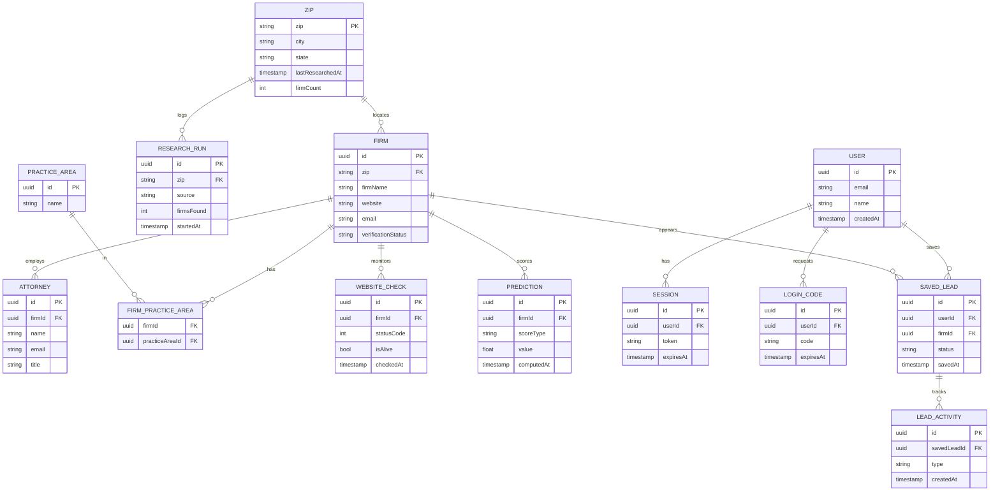

# Legal Prospector — data model (ERD)

Today only the `Firm` table exists; everything else here is the additive roadmap.

Render this anywhere that supports Mermaid:
- **VS Code** — open this file and use Markdown preview (with a Mermaid extension)
- **GitHub** — renders the diagram inline when committed to the repo
- **mermaid.live** — paste the diagram below, switch theme to "dark" or "default" for full contrast, and export PNG/SVG

**Clusters:**
- Data spine: `ZIP → FIRM → ATTORNEY`, with `PRACTICE_AREA` via the `FIRM_PRACTICE_AREA` join (many-to-many)
- Time-series (what makes it a data app): `RESEARCH_RUN`, `WEBSITE_CHECK`, `PREDICTION`
- Workspace (sales CRM): `USER → SESSION` / `LOGIN_CODE`, and `USER → SAVED_LEAD → LEAD_ACTIVITY`

